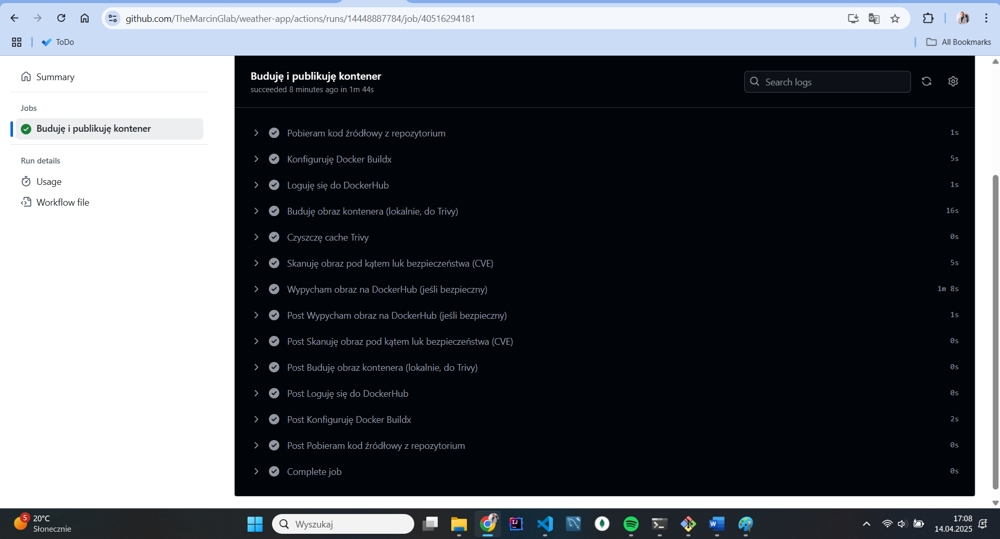
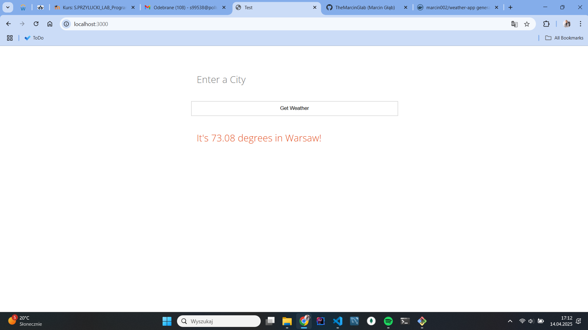

Polecenia do zbudowania obrazu:

docker buildx build --no-cache \
  --build-arg VERSION=1.0.0 \
  --platform linux/amd64 \
  -t weather-app:1.0 \
  --load \
  .

Polecenie do uruchomienia obrazu:
docker run -d -p 3000:3000 --name weather-app-container weather-app:1.0

